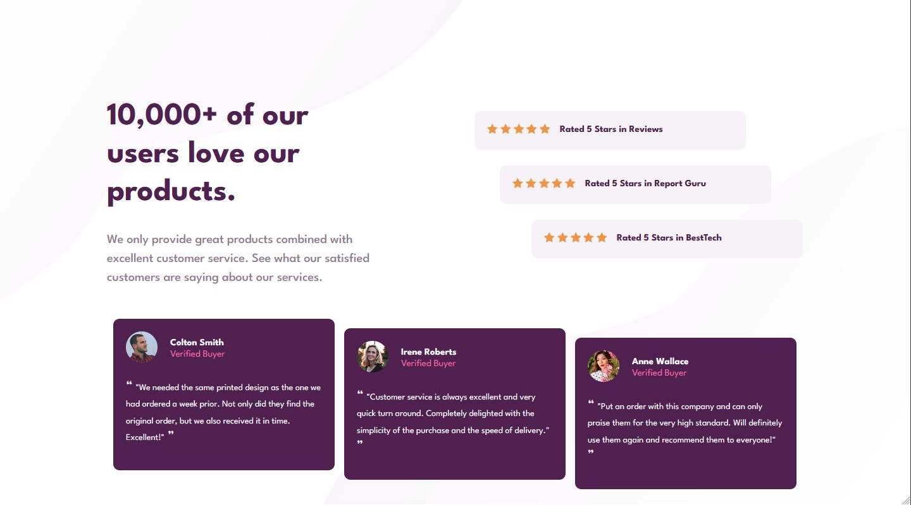

# Frontend Mentor - Social proof section solution

This is a solution to the [Social proof section challenge on Frontend Mentor](https://www.frontendmentor.io/challenges/social-proof-section-6e0qTv_bA). Frontend Mentor challenges help you improve your coding skills by building realistic projects.

### The challenge

Users should be able to:

- View the optimal layout for the section depending on their device's screen size

### Screenshot

### Links

- Solution URL: [social-proof-section-master](https://6520832d83e18d04f1facf32--funny-shortbread-c90070.netlify.app/)

### Built with

- Semantic HTML5 markup
- CSS custom properties
- Flexbox
- Mobile-first workflow

## Author

- Frontend Mentor - [@Campiottocodes](https://www.frontendmentor.io/profile/Campiottocodes)
- LinkedIn - [Vinicius Campiotto](https://www.linkedin.com/in/vinicius-campiotto-421233250/)
